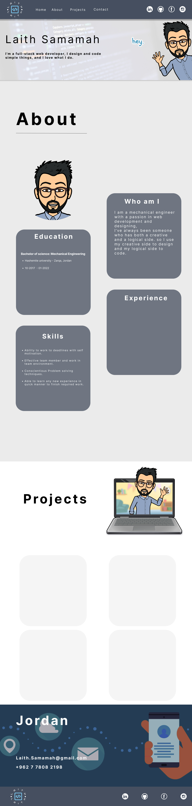
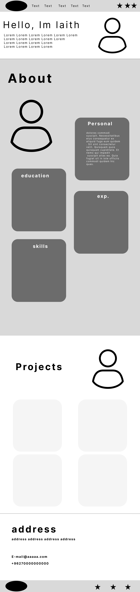

A portfolio is the thing that contains your projects mainly, in addition to projects, it contains multiple other components like contact form, bio, etc.
This is a portfolio that I made using HTML, CSS and some Bootstrap elements.

https://laith-samamah.github.io/Portfolio/ <---------Live url--------->

https://www.figma.com/file/xvCzJRJYrVM3fnnBkuWhIq/Portfolio?node-id=0%3A1 <---------Mockup link--------->

https://www.figma.com/file/uAQYm3VLJPEdM9O6qhTcaz/port-wire?node-id=0%3A1  <---------Wireframe link--------->

